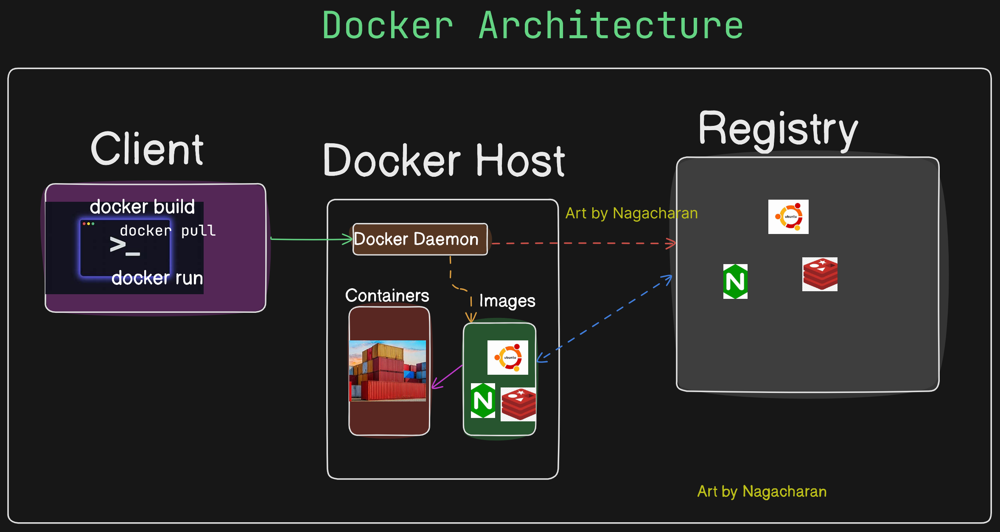
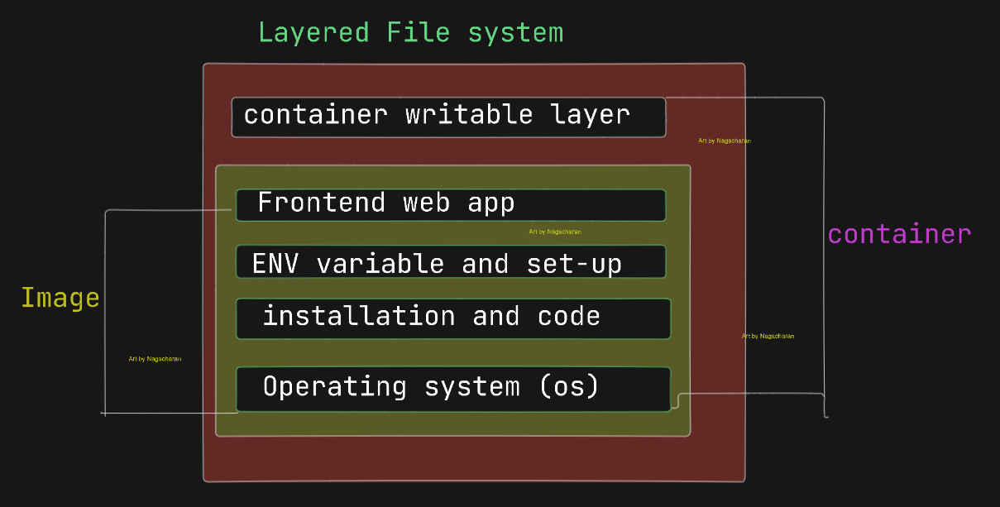
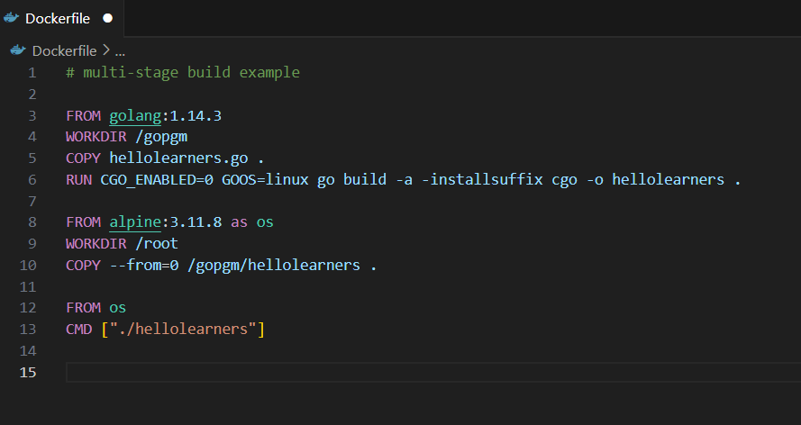
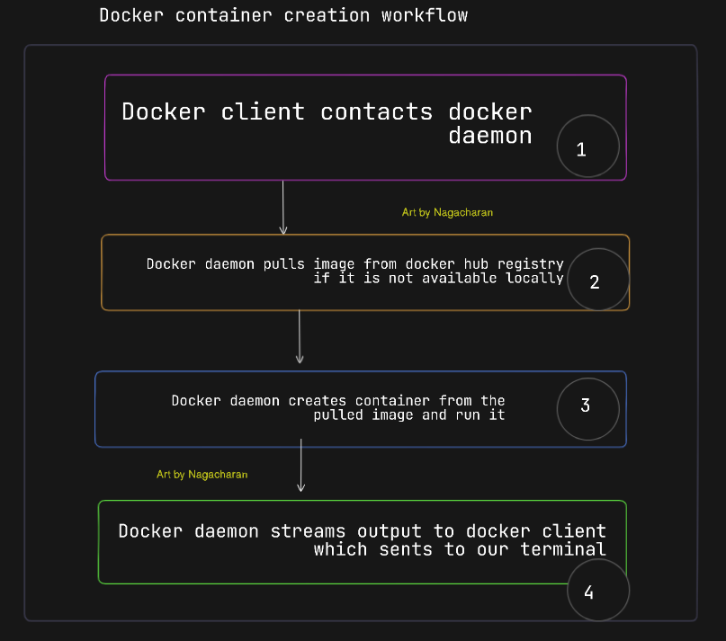

## what is Docker ?
- Docker is an opensource software tool which allows us to create, run, deploy applications using containers
- Docker uses a technology called namespaces to provide the isolated workspace called the container. When you run a
container, Docker creates a set of namespaces for that container
- Docker is written in GO language
- Docker enables you to separate your applications from your infrastructure so you can deliver software quickly.
- With Docker, you can manage your infrastructure in the same ways you manage your applications


- Docker Inc. was founded by Kamel Founadi, Solomon Hykes, and Sebastien Pahl during the Y Combinator Summer 2010
startup incubator group and launched in 2011
- Docker is available in two editions 1. Community Edition and 2. Enterprise Edition

## Docker Architecture




Components of Docker Architecture :

```
> Docker Client

> Docker Daemon

> Docker containers

> Docker Images

> Docker Registry
```


- Docker uses **client-server architecture**.
- **Docker client** talks to the docker daemon using REST API protocol over unix sockets or network interfaces
- Docker daemon does the heavy lifting of building, running and distributuing docker containers
- **Docker daemon (dockerd)** is the docker engine (which represents the server ) listens for docker api requests and manages docker objects like images, containers, networks and volumes.
- **Docker registry** stores the docker images
- **Docker Hub** is a public registry that anyone can use, and Docker is configured to look for images on Docker Hub by
default. You can even run your own private registry.
- When you use the docker pull or docker run commands, the required images are pulled from your configured registry.
- When you use the docker push command, your image is pushed to your configured registry.

### Docker Images

- An image is a read-only template with instructions for creating a Docker container. Often, an image is based on
another image, with some additional customization. 

or

- Docker image is a file which contains dependencies , binaries and required configuration to run software inside a container

- An image is built up of series of layers and 
each layer represents an instruction in the 
image

- When a container is created from an 
image it adds a new writable layer on top 
of the image layers.
This layer is called as "container layer"

For example, you may build an image which is based on the
Ubuntu image, but installs the Apache web server and your application, as well as the configuration details needed to
run application.
- Docker template is written in a language called YAML, which stands for Yet Another Markup Language. 
- The Docker image is built within the YAML file and then hosted as a file in the Docker registry.

- Dockerfile extension is `Dockerfile`

**Note:** 
- we can use `docker` also but as a best practice we use `D` at the begining of dockerfile name

- same applicable for all the instructions in the dockerfile also like using `FROM` instead of `from` etc.

- Ex for keywords in docker file are : FROM, WORKDIR, COPY, RUN, CMD etc.

`$ docker pull <image name>:<tag>`

`$ docker image pull <image name>:<tag>` (recommended way)



`$ docker image history <image name>` --> to list all layers of an image


#### Dockerfile
- Dockerfile is a set of instructions and commands used to build an image

**Build image**
```
docker image build -t <tag> .
docker image build -t <tag> -f <dockerfile name> .
docker image build --no-cache -t <tag> .
```

Keypoints to remember:
- Ephermeral container
- Order of execution
- Keep image size minimum
    > Avoid unnecessary package and files
    > use multi-stage build
    > keep number of layers to minimum

👇 Basic Dockerfile


👇 Dockerfile for python application


- Each prorgram language has it's own commands so, arguments will change but not the Instructions

```
Instruction ARGUMENT
|          |
FROM baseImage
```

##### Frequently used Dockerfile Instructions:

```
FROM -> sets base/parent image
LABEL -> Adds metadata to the image
RUN -> creates new layer
EXPOSE -> Intend port to publish
CMD -> Setting default command for container. It can be overridden
ENTRYPOINT -> Specify executable inside the container, it does not get overridden
. It can be overridden by --entrypoint flag
WORKDIR -> sets current working directory
COPY -> copy file from one location to another, if spaces include quotes
ADD -> The ADD instruction in a Dockerfile allows you to copy files or directories from a source location into your Docker image. This source can be a local directory, a URL, or a TAR file.
ENV -> to set environmental variables. It can be overridden by --env flag. ENV [key]=[value]
USER -> set user

ex: USER dockeruser

ARG -> Declared before FROM instruction

HEALTHCHECK -> Checks the health of a container by running a command inside the container.
 > can be only one health check instruction in a docker file

 options for CMD
 ✅ --interval=DURATIOn (default:30s)
 ✅ --timeout=DURATIOn (default:30s)
 ✅ --start-period=DURATION (default:30s)
 ✅ --retries=N(default:3)

 HEALTHCHECK --interval=5s CMD curl localhost:<port>
```
COPY vs ADD
- If you want to extract a TAR file inside a Docker Container or copy files from a URL or local directory, you can specify ADD Instructions inside your Dockerfile. This is different from COPY instruction because COPY instruction only allows you to copy files and directories from the local machine.

**pull image**
`$ docker image pull nginx`

`$ docker image ls`

**search an image**
`$ docker search nginx`

**limit the number of result**
`$ docker search --limit 10 nginx`

**filter search result**
`$ docker search --filter stars=200 nginx`

`$ docker search -f stars=100 -f ls-official=true nginx`

**list images**
`E docker images`
`$ docker image ls`
`$ docker image ls -a`

**tag an image**
`$ docker image tag <source image>:<tag> <reference to source image>:<tag>`

**delete an image**
`$ docker image run nginx`
`$ docker rmi ngnix`
**remove dangling image**
`$ docker image prune`
**remove all unused and dangling image**
`$ docker image prune -a`
inspect an image
`$ docker image inspect nginx`

`$ docker image inspect nginx --format"{{ContainerConfig.Hostname}}"`

#### Flattening an image

- flattening an image to a single layer to save some space and get an extra performance

execution steps
```
docker export
docker import
docker image history
```

**Multi-stage builds**
- Multi-stage builds will have more than one FROM instruction in the dockerfile
- Each FROm instruction creates a new build



**save an image**
- save one or more image to a tar archive
`$ docker image save <image name> > <archive name>.tar`

**load an image**
- load an image from a tar archieve or STDIN

`$ docker image load < <archieve name> `

### Docker Containers

- A container is a runnable instance of an image. You can create, start, stop, move, or delete a container using the
Docker API or CLI.
- You can connect a container to one or more networks, attach storage to it, or even create a new image based on its
current state.
- By default, a container is relatively well isolated from other containers and its host machine. You can control how
isolated a container’s network, storage, or other underlying subsystems are from other containers or from the host
machine.
- Docker Container is a running environment for Image. Images like Redis, Ubuntu, Nginx, Alphine and etc

- When you create containers 
from an image, the container and 
image become dependent on each 
other and you can't delete the image 
until all the containers attached to 
that image have been deleted.
- When the container is deleted, the 
container layer is also deleted. 
However, the underlying image 
remains unchanged.

| Docker | virtual machine |
| --- | --- |
|os level process isolation|Hardware level process isolation|
|Docker makes use of the executable engine| Virtual machine makes use of the hypervisior|
| Lightweight  | High weight |
|Each container can share OS| Each VM has a separate OS|
|Containers are lightweight (KBS/MBS)| VMs are heigh weight (GBS)|
|uses less resources (cpu, memory)|Uses more resources (cpu, memory)|
|Boots in few seconds| Boots in few minutes|
|prebuild containers are easy to find|prebuild Vms are difficult to find|
|creation of containers takes less time|creation of vms is time consuming|

## Docker Installation

To install Docker, please follow instructions given on below links


[For RHEL
](https://docs.docker.com/engine/install/rhel/)

[For CentOS](
https://docs.docker.com/engine/install/centos/)

[For Ubuntu](
https://docs.docker.com/engine/install/ubuntu/)

[ For Mac](
https://docs.docker.com/desktop/install/mac-install/)

[ For Windows](
https://docs.docker.com/desktop/install/windows-install)


- we can verify the installation by using `$ docker --version`

#### Docker - Hello world

- In our first example, we are going to run a container with hello world image.
- To perform this practical, first check docker is running or not and if not then first docker daemon.
- To use this hello world image, to create and run this container with that image use below command
docker run hello-world
- So how above command works in background???
- We are running docker run command which is responsible for launching a container.
- hello-world is the name of the image created by someone on Dockerhub.
- So when we run above command then first it will search that image locally and if image is not available locally then it will 
search in Dockerhub.
- Once hello-world image has been downloaded, docker creates a container using that image and executes it.
- Check below flow for docker hello-world example




## Basic Commands

```
$ docker container run [OPTION1 OPTION2 … OPTIONn] [Image]:[TAG] [COMMAND] [ARGUMENT] --> to instantiate a container

- IMAGE: Docker Image.
- TAG: Run specific version of an image.
- COMMAND: Command to run inside the container.
- ARGUMENT: Arguments for the COMMAND.
```

**Run container**
- `$ docker run hello-world`
- `$ docker container run hello-world` (Recommended way)
- `$ docker run nginx`
- `$ docker container run nginx` (Recommended way)

**Run a container with COMMAND and ARGUMENT:**
`$ docker run busybox echo Hello learners`
```
echo: Command run inside the busybox container.
 Hello Learners!: Argument for the Command.
```

**List all containers (Running and stopped):**
`$ docker ps -a`
- a = all

**Remove a stopped container:**
`$ docker rm <container id>`

**docker help**
`$ docker --help | more`
```
> Management commands
> Commands
```
**Management commands**

**containers**: Manage containers
```
$ docker container --help
- run : Run a command in a new container
- ls : list containers
- rm : Remove one or more containers

```
**image**: Manage images
**network**: Manage networks
**node**: Manage swarm nodes

**Run container with options**
```
$ docker container run nginx
$ docker container run -d --name mynginx nginx:1.18.7

-d or --detach: detached/background mode
--name: provide desired meaningful name

```
**list running containers**
`$ docker container ls`
**list all containers (running and stopped)**
`$ docker container ls -a`

**remove a container**
`$ docker container rm <container id>`

**publish ports**
```
There are 2 types :
1. --publish or -p
2. --publish-all or -P

--publish or -p:
> publish a container's port(s) to the host
   >> docker container run -d --name [container name] -p [Host port]:[container port] [image]

   ex: docker container run -d --name mynginx -p 8080:80 nginx

--publish or -P :
> publish all exposed ports to random ports
   >> docker container run -d --name [container name] -P [image]

   ex: docker container run -d --name mynginx2 -P nginx
```

**display detailed information of a container**

`$ docker container inspect <container id/container name>`
ex: `docker container inspect mynginx`

**list port mapping**
`$ docker container port <container id/container name>`

ex: `$ docker container port mynginx`

**--interactive or -i or --tty or -t**
when you detach from the container it is going to stop the container.

--interactive or -i : keep STDIN open even if not attached
--tty or -t : Allocate pseudo-TTY

- `$ docker container run --name [container name] -it [image]`

ex: `$ docker container run --name myubuntu -it ubuntu`

**attach**
- attach local standard input, output, and error streams to a running container
- when you detach from the container, it's going to stop the container
`$ docker container attach [container name/container id]`
`$ docker container attach myubuntu`

**exec**
- Run a command in a running container
- exec  will not stop the container when you detach from the running container
`$ docker container exec [options][container id/container name][command][arguments]`
ex: `$ docker container exec -it myubuntu /bin/bash`

**container restart policy**
- Automatically start the containers when they exit, or when docker restarts
    `$ docker container run [options] --restart [restart policy][image]`

Types of restart policies:
- no
- on-failure
- always
- unless-stopped

```
no:
> default restart policy
> do not automatically restart the container

Ex: docker container run --restart no nginx
 
 docker container run nginx (same as above)

 on-failure:
 > Restart the container if it exits due to an error (i.e; non-zero exit code)
 ex: docker container run --restart on-failure [image]

 always:
 > always restart the container if it stops. if it is manually stopped, it is restarted only when docker daemon restarts or the container itself is manually restarted

 ex: docker container run -d --name mynginx --restart always -p 8080:80 nginx

 unless-stopped:
 > simmilar to always, except that when the container is stopped (manually or otherwise), it is not restarted even after docker daemon restarts

 ex: docker container run -d --name mynginx --restart unless-stopped -p 8081:80 nginx
```


**container basic commands:**

**list running containers**
`$ docker container ls `(recommended way)

`$ docker ps`

**list all containers (running and stopped)**
`$ docker container ls -a`(recommended way)

`$ docker ps -a`

**stop a container**
`$ docker container stop <container id/container name>`

**start a container**
`$ docker container start <container id/container name>`

**pause a container**
`$ docker container pause <container id/container name>`

**unpause a container**
`$ docker container unpause <container id/container name>`
**fetch the logs of a container**
`$ docker container logs <container name/container id>`

**To see container resource usage statistics**
`$ docker container stats <container id/container name>`

**To see running processes of a container**
`$ docker container top <container id/container name`

### Image basic commands

**pull an image**
    `$ docker image pull <image>`
**list images**
`$ docker image ls`
**to see detailed information of an image**
`$ docker image inspect <image>`

### cleanup: Remove Images and Containers

**Remove a stopped container**
    `$ docker container rm <container id/container name>`
**Remove all stopeed containers**
    `$ docker container prune`

**Remove a running container**
`$ docker container rm -f <container name/container id>`
**Remove all stopped and running containers**
`$ docker container rm -f ` `docker ps -a -q`
`$ docker container rm -f` `docker container ls -a -q`
**Remove an image**
`$ docker image rm <image>`
**Automatically remove a container when it exists**
`$ docker container run --rm <image>`

#### Uninstall and upgrade docker

uninstall docker engine
```
- sudo systemctl stop docker
- sudo apt-get remove -y docker-ce docker-ce-cli
- sudo apt-get update
```

install docker engine (lower version)

`$ sudo apt-get install -y docker-ce=5:18.09.4~3-0~ubuntu-bionic docker-ce-cli=5:18.09.4~3-0~ubuntu-bionic`

check docker engine version
`$ docker version`

upgrade docker engine
`$ udo apt-get install -y docker-ce=5:18.09.5~3-0~ubuntu-bionic docker-ce-cli=5:18.09.5~3-0~ubuntu-bionic
`

## Persistent and non-persistent storage


## Docker storage - volumes

## Docker storage - Bind mounts, volume instruction

## storage drivers


## Docker swarm

- Run containers on multiple servers as a cluster
- Build distributed cluster of docker machine
- supports orchestration, high-availability, scaling, load balancing etc


**Manager**
- Assign work to worker nodes
- Responsible for controlling the cluster and orchestration

**workers**
- Responsible for running container workloads

**Configure swarm manager**

```
docker info | grep swarm

docker swarm init --advertise-addr <swarm manager private Ip>

docker info | grep swarm

docker node ls
```

**Add workers node to swarm manager**
- install Docker CE
-`$ docker swarm join-token worker `(on swarm manager)
- `$ copy and run the swarm join-token output` (on worker node)
- `$ docker node ls` (on swarm manager)


## Docker services

####  Replicated and Global mode

#### Docker Swarm Quorum

containers and labels

## Docker Compose

## Docker stack

## Docker Networking

#### Docker embedded DNS

## Port publishing modes

## docker security

## docker content trust

## logging drivers


